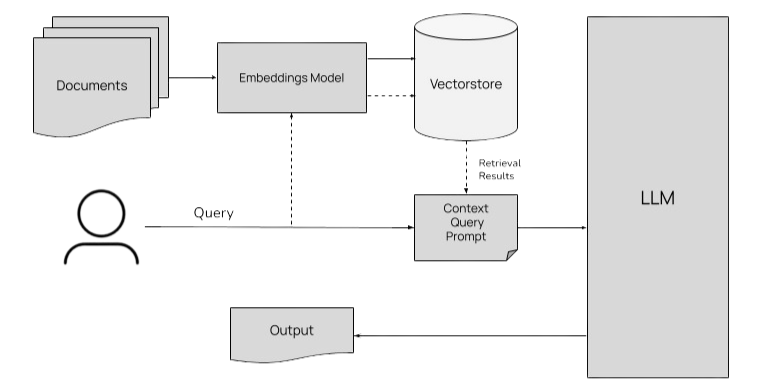

# Economics Q&A Chatbot

## Overview

The **Economics Q&A Chatbot**  is a Retrieval-Augmented Generation (RAG)-based chatbot that provides answers to questions related to economics. The system scrapes articles from Wikipedia, processes the data into vector embeddings, and utilizes Google Gemini (model: gemini-1.5-flash-8b) to generate responses.

## Demo Video

Watch the demo video to see the Economics Q&A Chatbot in action:

[https://www.youtube.com/watch?v=qGUM6cORDSw](https://www.youtube.com/watch?v=qGUM6cORDSw)

## Project Structure

```
RAG project
├─ Data
│  ├─ chunked_data.json
│  ├─ combined_Raw_Data.json
│  ├─ faiss_index.index
│  └─ faiss_index.json
├─ EvaluationAndTesting
│  ├─ Evaluate_model.py
│  ├─ Evaluation
│  │  ├─ CummulativeEvaluationReport.txt
│  │  └─ EvaluationReport.xlsx
│  ├─ Testing_data
│  │  ├─ generated_answers_misleading.csv
│  │  ├─ generated_answers_multilingual.csv
│  │  ├─ generated_answers_wrong_vocab_grammar.csv
│  │  ├─ generated_answers.csv
│  │  ├─ golden_set.json
│  │  ├─ golden_set2.json
│  │  ├─ misleading.json
│  │  ├─ multilingual.json
│  │  └─ wrong_vocab_grammar.json
│  ├─ generate_Q&A_set.py
│  ├─ generate_Q&A_set2.py
│  ├─ generate_answers.py
│  └─ generate_answers2.py
├─ Logging
│  └─ user_queries_log.json
├─ Processing
│  ├─ __pycache__
│  │  └─ rag_pipeline.cpython-310.pyc
│  ├─ chunker.py
│  ├─ generate_embeddings.py
│  └─ rag_pipeline.py
├─ README.md
├─ Scraper
│  ├─ Scraper.py
│  └─ list.txt
├─ Unit Testing
│  └─ test_rag_project.py
├─ app.py
├─ articles
│  ├─ Aggregate_demand.txt
│  ├─ Austerity.txt
│  ├─ Austrian_school_of_economics.txt
│  ├─ Balance_of_trade.txt
│  ├─ Behavioral_economics.txt
│  ├─ Bond_market.txt
│  ├─ Central_bank.txt
│  └─ ...
└─ requirements.txt
```

## Installation

1. **Clone the Repository**

   ```bash
   git clone https://github.com/dhruvguptashorthills/Economics-Q-A-Chatbot-.git
   cd Economics-Q-A-Chatbot-
   ```

2. **Install Dependencies**

   ```bash
   pip install -r requirements.txt
   ```

3. **Add Your Gemini API Key**

   Create a .env file in the root directory of the project and add your Gemini API key:

   ```bash
   echo "API_KEY=your_api_key_here" > .env
   ```

   Replace `your_api_key_here` with your Gemini API key.

## Start the Chatbot App

Launch the local Streamlit interface:

```bash
streamlit run app.py
```

## Other Usage

### 1. Data Scraping

Run the web scraper to collect more economic articles:

```bash
python3 Scraper/Scraper.py 
```

### 2. Data Processing & Chunking

Clean and split the scraped text into manageable chunks:

```bash
python3 Processing/chunker.py
```

### 3. Data Embedding Generation

Convert chunked text into vector embeddings:

```bash
python3 Processing/generate_embeddings.py
```

## Evaluation

The chatbot is evaluated using a predefined **golden set** of 1000+ Q&A pairs. To test accuracy:

```bash
python EvaluationAndTesting/Evaluate_model.py
```

## RAG Architecture



## Functionality

1. **Web Scraping & Data Collection**

   - Extracts articles from predefined URLs using [Scraper.py](https://github.com/dhruvguptashorthills/Economics-Q-A-Chatbot-/blob/main/Scraper/Scraper.py).
   - Saves articles as text files and compiles them into a structured JSON file.

2. **Text Processing & Chunking**

   - Cleans and splits articles into manageable chunks using [chunker.py](https://github.com/dhruvguptashorthills/Economics-Q-A-Chatbot-/blob/main/Processing/chunker.py).
   - Saves chunked data to a JSON file for embedding.

3. **Embedding Generation & Storage in FAISS**

   - Converts text chunks into embeddings using [generate\_embeddings.py](https://github.com/dhruvguptashorthills/Economics-Q-A-Chatbot-/blob/main/Processing/generate_embeddings.py).
   - Stores embeddings in FAISS for fast retrieval.

4. **Query Processing & Retrieval (RAG Pipeline)**

   - Searches FAISS for relevant text chunks using [rag\_pipeline.py](https://github.com/dhruvguptashorthills/Economics-Q-A-Chatbot-/blob/main/Processing/rag_pipeline.py).
   - Constructs a context-aware prompt for the AI model and generates an answer.

5. **Question Generation & Golden Set Creation**

   - Generates questions and answers using [generate\_Q&A\_set.py](https://github.com/dhruvguptashorthills/Economics-Q-A-Chatbot-/blob/main/EvaluationAndTesting/generate_Q%26A_set.py).
   - Saves compiled Q&A sets for evaluation.

6. **Model Evaluation & Performance Metrics**

   - Compares generated responses with golden set answers using [Evaluate\_model.py](https://github.com/dhruvguptashorthills/Economics-Q-A-Chatbot-/blob/main/EvaluationAndTesting/Evaluate_model.py).
   - Outputs an evaluation report.

7. **Streamlit User Interface**

   - Provides a real-time interactive UI via [app.py](https://github.com/dhruvguptashorthills/Economics-Q-A-Chatbot-/blob/main/app.py).
   - Logs user queries for tracking interactions.

## Evaluation Result

The evaluation was conducted using a golden set of 1000+ Q&A pairs to measure the Semantic Similarity Score of the chatbot's responses.

   - Percentage of test cases above threshold(0.5): 80.05%
   - **Semantic Similarity Score**: 0.6735
   - **Rouge Score**: 0.3072
   - **BLEU Score**: 0.0999
   - **BERTScore**: 0.3490
   - **Final Score**: 0.6735
   - **Total Test Cases**: 1349
   - **Passed Test Cases**: 1082
   - **Failed Test Cases**: 267

## Technologies Used

- **Python** (Data processing & LLM integration)
- **BeautifulSoup, Scrapy** (Web scraping)
- **FAISS** (Vector database)
- **OpenAI/Llama Models** (LLM-based responses)
- **Streamlit** (User interface)
- **Azure Blob Storage** (Data storage)

## License

This project is licensed under the MIT License.
